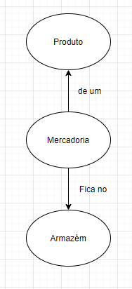

# Estoque

o principal objetivo aqui é mostrar o que tem de mercadorias

- Registra entrada e saída de mercadorias

## Entidades

A principal entidade é a mercadoria, mas também temos o produto e o armazém
- Mercadoria
- Produto
- Armazém
- Evento

## Mercadoria
A mercadoria é uma unidade física de um produto contida no armazém

## Produto
O produto é uma representação abstrata de uma mercadoria, seria a descrição da mercadoria. Um template, molde e etc. O produto é etiquetável

## Armazém
O armazém é onde ficam as mercadorias por tempo limitado

## Eventos
Eventos são registros imutaveis da entrada e saída das mercadorias num momento do tempo

# Exemplo
## Dado os produtos:
- Zomo de Uva - ID 1
	- etiquetas: Zomo, essência
- Zomo de Morango - ID 2
	- etiquetas: Zomo, essência

## Então 
- O armazém tem 75 mercadorias do produto ID 1
- O armazém tem 0 mercadorias do produto ID 2