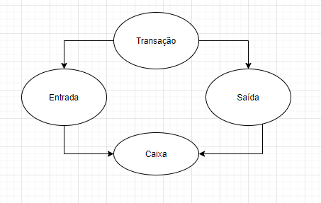

# Financeiro

o principal objetivo aqui é mostrar o fluxo de caixa para o Vinicius.

- Registra entrada e saída no caixa

## Entidades

A principal entidade é a transação, mas também temos o caixa que é o estado do financeiro
- Transação
- Caixa
- Livro caixa

## Transação
A transação é um registro imutável de um trânsito monetário em um momento no tempo

## Entrada

Uma transação de entrada pode ser uma venda de mercadoria, uma doação, reembolso do fornecedor, caixinha do cliente

## Saída

Uma transação de saída poder ser uma compra de mercadoria, um reembolso pro cliente, capital de giro, pagar o emprestimo ou financiamento, pagamento do funcionário, despesas fixos e variáveis (aluguel, gasolina, água).

## Caixa
O caixa representa o uma foto, trânsito de todas as transações até aquele momento do tempo.

# Livro caixa
Um relatório das transações em um intervalo de tempo

# Caixa é valor, livro caixa é uma projeção (um recorde num tempo)