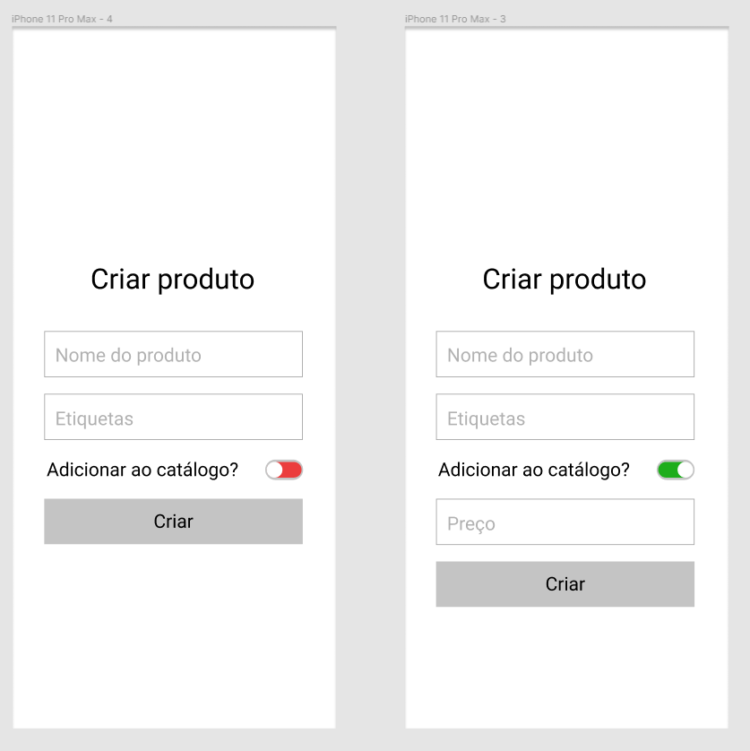
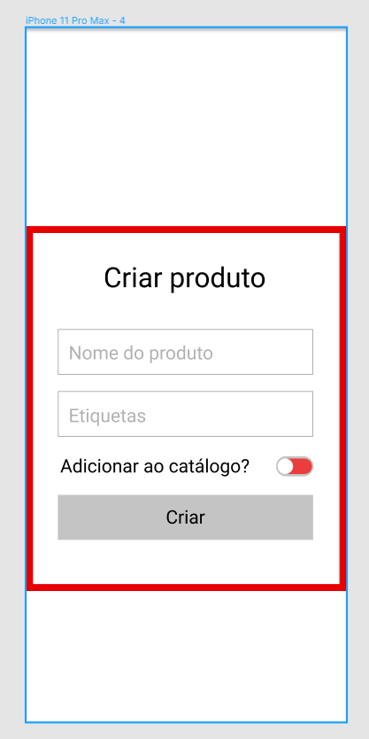
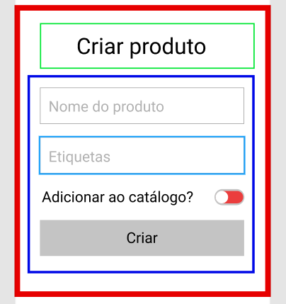
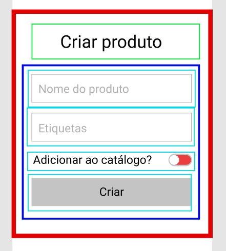
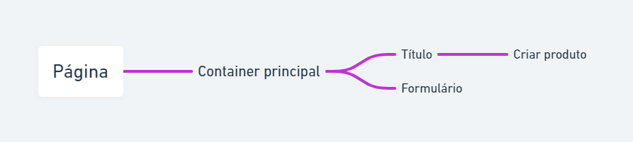
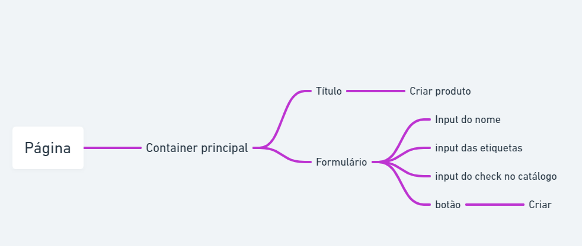
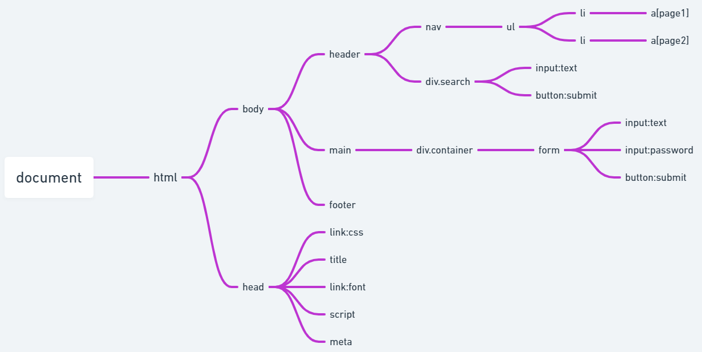

# Como fazer uma página?


## Passo #1 - Análise

A primeira coisa a se fazer numa págine é olhar a estrutura da página
e tentar extrair os componentes, veja esse exemplo:



## Primeira olhada

Na primeira página temos um componente principal, que é o
que está circundando todo o conteúdo da página. (Vermelho)



## Segundo ponto

Depois de verificar o container principal que contém todo o conteúdo
da página, isolaremos esse container para identificar seus componentes
internos.

Dentro do nosso componente principal temos mais dois
componentes, que é Título (Verde) e o Formulário (Azul).

O container principal da página é composto de dois componentes, para fazer
análise de um componente composto de outros elementos devemos primeiro
fazer uma análise top-down (de cima pra baixo). Então bora lá

Nosso primeiro componente do container é o Título que é um texto indicando o
nome da página.

O Segundo é o nosso formulário que o usuário irá preencher para criar
o produto.



## Terceiro ponto

O nosso título acaba aqui mesmo pois não há mais nada a se analisar nesse
componente, iremos para o formulário.

Nosso formulário é composto de:

- Um input de texto para o nome
- Um input de texto para as etiquetas
- Um input de check para adicionar no catálogo
- Um botão de criação do produto



### Fim

Por fim fizemos a nossa análise minuciosa da estrutura da página e conseguimos
assim passar para o próximo passo.

# Passo #2 - Criar a estrutura

Depois de fazer a análise iremos, desenvolver a o mapa mental
da nossa página, passar todo esse conhecimento para um diagrama visual,
mostrando que entendemos o que deve ser feito.

# Primeira coisa

Primeiro vamos escrever por extenso a nossa análise da página

A nossa página tem um container com o conteúdo principal,
composto de 2 componentes dentro, um é o título e o outro é
o formulário. O título tem um texto "Criar produto". O formulário
é composto de outros componentes dentro, sendo eles:
input de texto para o nome do produto; input de texto para etiquetas;
um input de checagem com o rótulo "Adicionar ao catálogo"; e um botão
com o texto "Criar".

Agora iremos passar para um diagrama para deixarmos visualmente mais fácil
para a implementação

Iremos usar um mapa mental para isso.

# Construindo o diagrama de árvore

No topo nós colocamos a página em si


Iremos adicionar nosso container principal na página.


Depois colocaremos o título e o formulário


Depois adicione o texto do título



Depois coloque os componentes internos do formulário




# Fim

Por fim consiguimos estruturar nosso conhecimento da análise num gráfico
agora temos uma versão analítica desenvolvida.

# Passo #3 - Falar é fácil, quero ver fazer

## Agora sim vamos para o código.

## Mas antes, pausa pra uma observaçãozinha

O motivo de eu ter utilizado a estrutura de árvore para descrever a análise
é porque todas as páginas são construídas em árvore, inclusive a linguagem
que usamos para estruturar a página é feita dessa forma, o próprio HTML
é uma árvore de elementos.

Só por curiosidade segue o exemplo de uma página em HTML

```html
<!DOCTYPE html>
<html>
<head>
    <meta charset="UTF-8">
    <title>Document</title>
    <link rel="stylesheet" href="style.css">
    <link href="https://fonts.googleapis.com/css2?family=Roboto:wght@100&display=swap" rel="stylesheet">
    <script src="script.js"></script>
</head>
<body>
    <header>
        <nav>
            <ul>
                <li><a href="page1">Page1</a></li>
                <li><a href="page2">Page1</a></li>
            </ul>
        </nav>
        <div class="search">
            <input type="text" name="" id="">
            <button type="submit">Buscar</button>
        </div>
    </header>
    <main>
        <div class="container">
            <form action="">
                <input type="text">
                <input type="password">
                <button type="submit">Enviar</button>
            </form>
        </div>
    </main>
    <footer>COPYRIGHT</footer>
</body>
</html>
```

Agora esta mesma página no digrama em árvore



Desta forma fica muito mais fácil imaginar o código e pensar na estrutura
antes de sair escrevendo, pois o diagrama é muito mais fácil de construir
e refazer que um código HTML.

## Voltando ao código

Por causa que o projeto é em react eu vou fazer o código em react,
mas é bem próximo do html normal

A gente faz copiar o diagrama da esquerda para a direita


Começando pela página temos

```jsx
const Pagina = () => <ContainerPrincipal />
```

Seguindo para o ContainerPrincipal

```jsx
const ContainerPrincipal = () => (
  <div>
    <Titulo />
    <Formulario />
  </div>
)
```

O Titulo é bem simples só um texto h1

```jsx
const Titulo = () => <h1>Criar produto</h1>
```

Então vamos ao formulário

```jsx
const Formulario = () => (
  <form>
    <input type="text" />
    <input type="text" />
    <label>
      Adicionar ao catálogo?
      <input type="checkbox" />
    </label>
    <button>Criar</button>
  </form>
)
```
